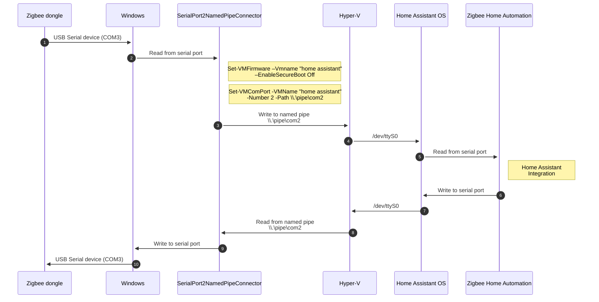

# Serial port to named pipe connector

Serial port (e.g., COM3) to named pipe (e.g., \\.\pipe\com2) connector

## Prior art

There are several projects that do similar thing:

[COMpipe](https://github.com/tdhoward/COMpipe)

[Convey](https://github.com/weltling/convey)

[PipeToCom](https://github.com/albertjan/PipeToCom)

However, they do not support running them as Windows Service or they have been abandoned by the maintainers.

Main use case for this connector is to run
[Home Assistant Operating System](https://www.home-assistant.io/installation/windows)
in Hyper-V VM and connect it to serial devices (e.g., Zigbee dongle) on the host.

Here is sequence diagram to illustrate how it works:



## Installation

Create COM port for virtual machine and map that to named pipe:

```powershell
Set-VMFirmware –Vmname "home assistant" –EnableSecureBoot Off
Set-VMComPort -VMName "home assistant" -Number 2 -Path \\.\pipe\com2
```

Validate the mapping:

```powershell
Get-VMComPort -VMName "home assistant"

VMName         Name  Path
------         ----  ----
Home assistant COM 1 
Home assistant COM 2 \\.\pipe\com2
```

```powershell
sc.exe create "Serial port to named pipe connector" binPath="C:\Path\To\SerialPort2NamedPipeConnector.exe"
```

**Note:** COM 1 *might* be used for serial console, so safer to use use COM 2.

### Links

[Create a Windows Service using BackgroundService](https://learn.microsoft.com/en-us/dotnet/core/extensions/windows-service)

[SerialPort Class](https://learn.microsoft.com/en-us/dotnet/api/system.io.ports.serialport?view=dotnet-plat-ext-7.0)

[How to: Use Named Pipes for Network Interprocess Communication](https://learn.microsoft.com/en-us/dotnet/standard/io/how-to-use-named-pipes-for-network-interprocess-communication)

[How can I enable kernel debugging by using a COM port on a generation 2 virtual machine?](https://learn.microsoft.com/en-us/previous-versions/windows/it-pro/windows-server-2012-R2-and-2012/dn282285(v=ws.11)#how-can-i-enable-kernel-debugging-by-using-a-com-port-on-a-generation-2-virtual-machine)

[Configure UART/COM in Linux using Hyper-V Generation 2 VM](https://superuser.com/questions/1032490/configure-uart-com-in-linux-using-hyper-v-generation-2-vm)

[Hyper-V Serial port - Step-By-step guide](https://www.eltima.com/com-port-in-virtual-machine/hyperv-serial-port-passthrough/)

[deCONZ Serial Protocol](https://github.com/dresden-elektronik/deconz-serial-protocol)

[deCONZ — Serial Protocol](https://deconz.dresden-elektronik.de/raspbian/deCONZ-Serial-Protocol-en_1.21.pdf)

[Serial Line Internet Protocol](https://en.wikipedia.org/wiki/Serial_Line_Internet_Protocol)

[Named pipes hang when written asynchronously w/o async flag](https://github.com/dotnet/runtime/issues/31390)
